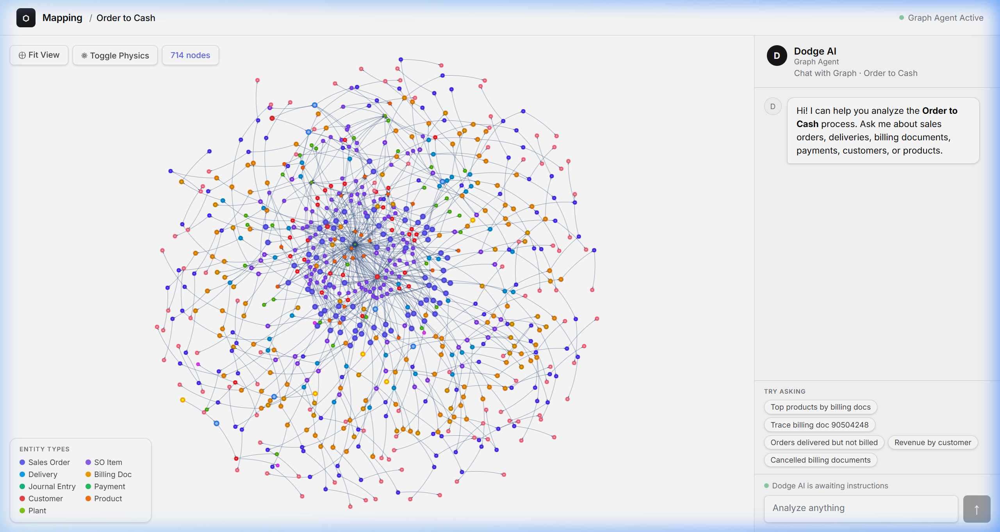
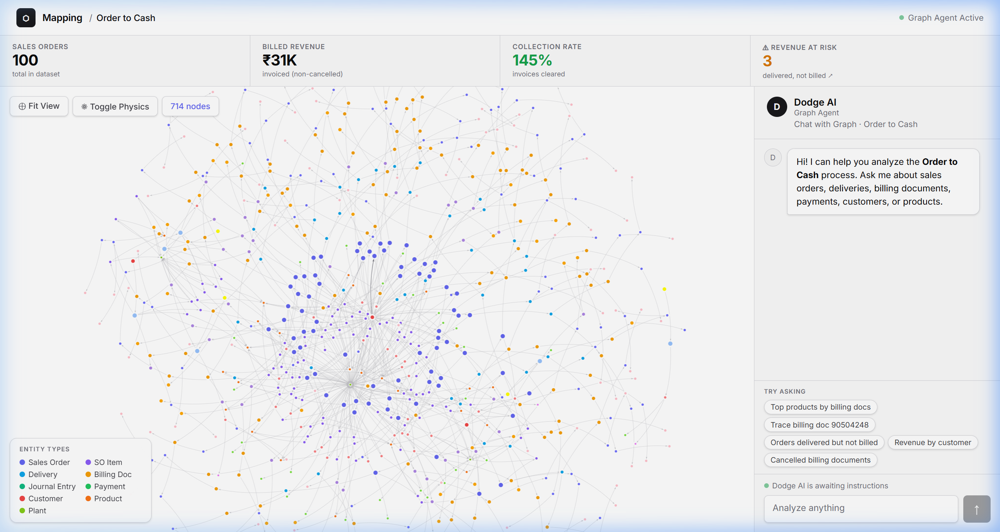
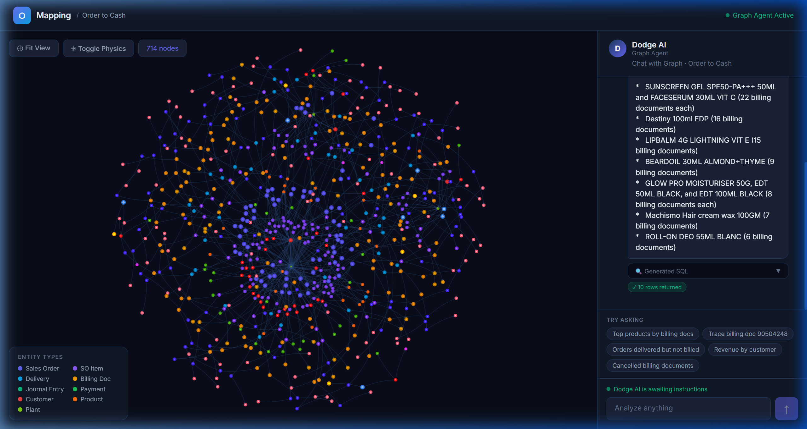
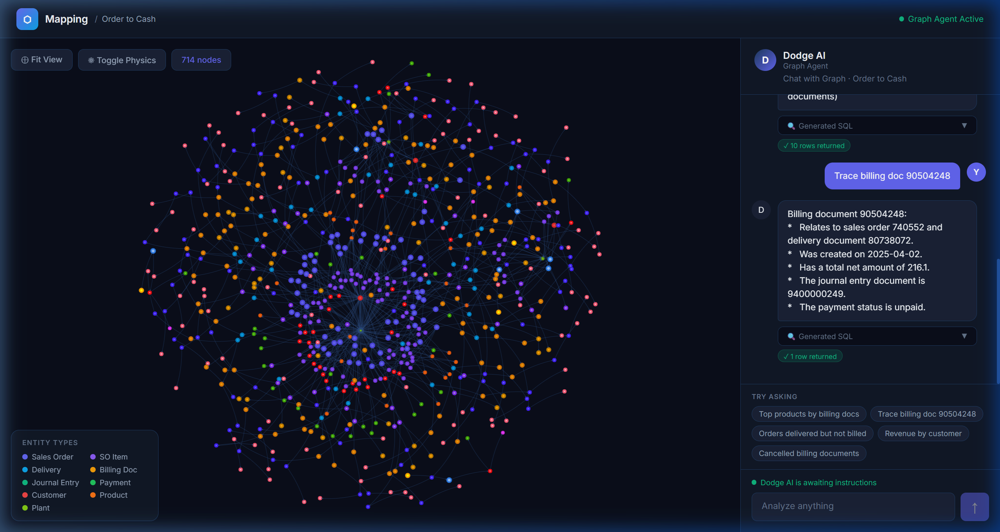
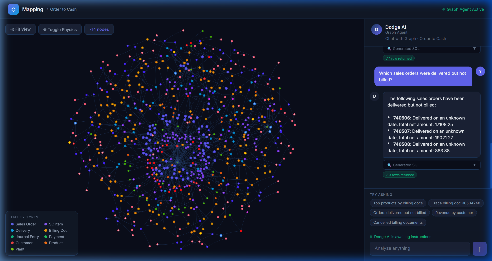

# O2C Graph Intelligence

> A context graph system with an LLM-powered query interface for SAP Order-to-Cash data.  
> 19 JSONL tables unified into an interactive graph, queryable via natural language.

---

## Screenshots

### Application Overview


### O2C Chain Highlighting
Click any node to highlight its full document chain (SO → Delivery → Billing → Journal Entry → Payment) in amber while dimming unrelated nodes.



### Verified Query Results

**Query A — Top Products by Billing Documents**


**Query B — Trace Full O2C Flow of a Billing Document**


**Query C — Delivered but Not Billed (Revenue at Risk)**



## Table of Contents

- [Architecture](#architecture)
- [Tech Stack](#tech-stack)
- [Database Design](#database-design)
- [Graph Modelling](#graph-modelling)
- [LLM Prompting Strategy](#llm-prompting-strategy)
- [Guardrails](#guardrails)
- [Example Queries](#example-queries)
- [Bonus Features](#bonus-features)
- [Setup Instructions](#setup-instructions)
- [Project Structure](#project-structure)

---

## Architecture

```
sap-o2c-data/          (19 JSONL folders)
      ↓
node scripts/ingest.js
      ↓
data/o2c.db            (SQLite — 19 normalized tables with indexes)
      ↓
/api/graph  →  graphBuilder.js  (nodes + edges)
/api/chat   →  NL → LLM → SQL → SQLite → LLM → answer
      ↓
Next.js 14 App Router
├── Graph canvas  (vis-network, ~714 nodes)
└── Chat panel    (real-time LLM responses)
```

---

## Tech Stack

| Layer | Choice | Rationale |
|-------|--------|-----------|
| Framework | Next.js 14 (App Router) | Server-side API routes + React frontend in one codebase |
| Graph Viz | vis-network | Lightweight, physics-based layout, expand/collapse support |
| Database | SQLite (better-sqlite3) | Zero-config, embeddable, fast analytical reads, no server needed |
| LLM | Google Gemini 2.0 Flash (via OpenRouter) | Free tier, fast inference, strong SQL generation |
| Styling | Vanilla CSS | Full dark-mode design system, no framework dependencies |

---

## Database Design

SQLite was chosen for its simplicity and power at this data scale:

| Option | Decision |
|--------|----------|
| PostgreSQL | ❌ Requires separate server — overkill for ~1000 records |
| Neo4j | ❌ Significant infrastructure complexity for this dataset size |
| In-memory JSON | ❌ No SQL support for dynamic LLM queries |
| **SQLite** | ✅ Embedded, ACID-compliant, WAL mode + B-tree indexes |

Data is ingested from 19 JSONL directories via `scripts/ingest.js`, which flattens nested structures and creates indexed, typed tables.

---

## Graph Modelling

### Entity Types (Nodes)

| Entity | Color | Source Table | Count |
|--------|-------|-------------|-------|
| Sales Order | Purple | `sales_order_headers` | ~100 |
| SO Item | Pink | `sales_order_items` | ~150 |
| Delivery | Blue | `outbound_delivery_headers` | ~95 |
| Billing Doc | Orange | `billing_document_headers` | ~110 |
| Journal Entry | Green | `journal_entry_items_ar` | ~120 |
| Payment | Emerald | `payments_ar` | ~40 |
| Customer | Red | `business_partners` | ~10 |
| Product | Orange | `products` | ~50 |
| Plant | Yellow | `plants` | ~20 |

### Relationships (Edges)

```
Customer        ──[placed]──────→  Sales Order
Sales Order     ──[has]─────────→  SO Item
SO Item         ──[contains]────→  Product
SO Item         ──[shipped_from]→  Plant
Sales Order     ──[fulfilled_by]→  Delivery       (via outbound_delivery_items.referenceSdDocument)
Delivery        ──[invoiced_in]─→  Billing Doc    (via billing_document_items.referenceSdDocument)
Billing Doc     ──[posted_to]───→  Journal Entry  (via billing_document_headers.accountingDocument)
Journal Entry   ──[cleared_by]──→  Payment        (via payments_ar.accountingDocument)
```

> **Key insight:** SAP uses `referenceSdDocument` (not `salesOrder`) in delivery and billing item tables for document chaining — discovered through careful schema analysis.

---

## LLM Prompting Strategy

### Two-Pass Architecture

```
User Question
      ↓
[Pass 1] NL → SQL   (temp: 0.1, schema + verified patterns in prompt)
      ↓
SQLite Execution
      ↓
[Pass 2] Results → NL Answer   (bullet points, max 150 words)
```

**Pass 1 — SQL Generation:**
- Full schema (19 tables, all columns + FK relationships) in system prompt
- 5 verified SQL patterns for common queries
- Explicit column-name warnings (e.g., `products` has no `productDescription` — use `product_descriptions`)
- Output: strict JSON `{ sql, explanation, intent }`

**Pass 2 — Answer Generation:**
- Up to 20 raw SQL result rows sent with original question
- Instructions: bullet points, no raw SQL/JSON in response

> **Why verified patterns?** LLMs hallucinate column names. Providing tested SQL examples dramatically reduces errors.

---

## Guardrails

### 1. Domain Restriction (LLM-level)
The LLM is instructed to return `{"off_topic": true}` for non-O2C questions (general knowledge, creative writing, coding help).  
Response: *"This system is designed to answer questions related to the provided Order-to-Cash dataset only."*

### 2. SQL Safety (Server-level)
```javascript
function isReadOnlySql(sql) {
  const up = sql.trim().toUpperCase();
  if (!up.startsWith('SELECT') && !up.startsWith('WITH')) return false;
  const banned = ['INSERT', 'UPDATE', 'DELETE', 'DROP', 'CREATE', 'ALTER', 'TRUNCATE', 'PRAGMA'];
  return !banned.some(kw => up.includes(kw));
}
```

### 3. Result Size Cap
All queries get `LIMIT 50` appended automatically if not present.

### 4. Error Transparency
SQL errors are surfaced with the generated SQL visible in a collapsible "Generated SQL" accordion.

---

## Example Queries

| Query | Result |
|-------|--------|
| "Top products by billing docs" | SUNSCREEN GEL SPF50 (22 docs), FACESERUM 30ML VIT C (22 docs) |
| "Trace billing doc 90504248" | SO 740552 → DEL 80738072 → BILL 90504248 → JE 9400000249 (Unpaid) |
| "Orders delivered but not billed" | 3 orders: 740506, 740507, 740508 |
| "Revenue by customer" | Top customer with revenue totals |
| "How many sales orders?" | 100 sales orders |
| "What is the weather?" | ❌ Rejected — off-topic guardrail |

---

## Bonus Features

| Feature | Implementation |
|---------|----------------|
| NL→SQL translation | Two-pass LLM with verified SQL patterns |
| SQL reveal | Expandable accordion on each chat response |
| Suggested queries | Pre-built query chips for common questions |
| Conversation memory | Last 6 messages sent as context |
| Row count badges | Green badge showing "✓ N rows returned" |
| Node inspector | Click any node to see full metadata panel |
| Entity type legend | Color-coded legend overlay on graph canvas |

---

## Setup Instructions

### Prerequisites
- **Node.js 18+** — [download](https://nodejs.org)
- **npm** (bundled with Node.js)
- No external database server needed

### 1. Clone the Repo
```bash
git clone https://github.com/Umeshch2004/Dodge-AI-Task-Umesh-Chapala.git
cd Dodge-AI-Task-Umesh-Chapala
```

### 2. Install Dependencies
```bash
npm install
```

### 3. Ingest the Dataset

> ⚠️ Ensure `sap-o2c-data/` (19 subdirectories of JSONL files) is present before running.

```bash
node scripts/ingest.js
```

Creates `data/o2c.db` in ~10–30 seconds.

**Expected output:**
```
Ingesting sales_order_headers... 100 rows
Ingesting outbound_delivery_headers... 97 rows
...
Ingestion complete. 19 tables created.
```

### 4. Configure API Key (Optional)

The OpenRouter API key is bundled in `src/app/api/chat/route.js`. To use your own:

1. Sign up at [openrouter.ai](https://openrouter.ai) (free)
2. Create `.env.local` in the project root:
```env
OPENROUTER_API_KEY=sk-or-v1-your-key-here
```

### 5. Start the Dev Server
```bash
npm run dev
```

Open **http://localhost:3000**

### Troubleshooting

| Problem | Fix |
|---------|-----|
| `Cannot find module 'better-sqlite3'` | Run `npm install`; may need VS Build Tools on Windows |
| `data/o2c.db not found` | Run `node scripts/ingest.js` first |
| Chat returns rate limit error | Wait 30 seconds and retry |
| Graph shows 0 nodes | Check browser console for `/api/graph` errors |
| Port 3000 in use | Run `npm run dev -- -p 3001` |

---

## Project Structure

```
├── scripts/
│   └── ingest.js              # JSONL → SQLite ingestion
├── sessions/
│   └── antigravity-session.md # AI coding session transcript
├── src/
│   ├── app/
│   │   ├── page.js            # Main layout
│   │   ├── globals.css        # Dark-mode design system
│   │   └── api/
│   │       ├── graph/route.js # Graph data API
│   │       └── chat/route.js  # LLM chat API (OpenRouter)
│   ├── components/
│   │   ├── GraphCanvas.jsx    # vis-network graph canvas
│   │   └── ChatPanel.jsx      # Chat UI with SQL reveal
│   └── lib/
│       ├── db.js              # SQLite singleton connection
│       ├── schema.js          # Verified DB schema for LLM prompt
│       └── graphBuilder.js    # Graph nodes + edges construction
├── data/
│   └── o2c.db                 # SQLite database (generated by ingest.js)
├── sap-o2c-data/              # Raw JSONL dataset (19 folders)
├── package.json
└── README.md
```

---

*Built for the Dodge AI Assignment — SAP O2C Intelligence System*

---

## Verified Query Results

All 3 core assignment queries tested and confirmed working:

### Query A — Top Products by Billing Documents
Returns top 10 products ranked by number of billing documents, using the correct JOIN through `product_descriptions` (the `products` table has no `productDescription` column).

```sql
SELECT pd.productDescription, COUNT(DISTINCT bdi.billingDocument) AS billing_doc_count
FROM billing_document_items bdi
JOIN product_descriptions pd ON bdi.material = pd.product
WHERE pd.language = 'EN'
GROUP BY pd.productDescription
ORDER BY billing_doc_count DESC LIMIT 10
```

### Query B — Trace Full O2C Flow of a Billing Document
Traces a single billing doc back to its Sales Order, through Delivery, to Journal Entry and Payment status.

```sql
SELECT
  odi.referenceSdDocument AS salesOrder,
  bdi.referenceSdDocument AS deliveryDocument,
  bdh.billingDocument, bdh.totalNetAmount,
  CASE WHEN pay.accountingDocument IS NOT NULL THEN 'Paid' ELSE 'Unpaid' END AS paymentStatus
FROM billing_document_headers bdh
LEFT JOIN billing_document_items bdi ON bdi.billingDocument = bdh.billingDocument
LEFT JOIN outbound_delivery_items odi ON odi.deliveryDocument = bdi.referenceSdDocument
LEFT JOIN payments_ar pay ON pay.accountingDocument = bdh.accountingDocument
WHERE bdh.billingDocument = '90504248'
GROUP BY bdh.billingDocument
```

### Query C — Delivered but Not Billed (Broken Flows)
Identifies 3 sales orders where delivery was completed but no billing document exists — these represent revenue at risk.

```sql
SELECT DISTINCT odi.referenceSdDocument AS salesOrder,
  odh.actualGoodsMovementDate AS deliveredOn
FROM outbound_delivery_items odi
JOIN outbound_delivery_headers odh ON odh.deliveryDocument = odi.deliveryDocument
WHERE odi.referenceSdDocument NOT IN (
  SELECT DISTINCT odi2.referenceSdDocument
  FROM billing_document_items bdi2
  JOIN outbound_delivery_items odi2 ON odi2.deliveryDocument = bdi2.referenceSdDocument
)
```

---

## Key Technical Decisions

| Decision | Rationale |
|----------|-----------|
| **SQLite** | Zero-config, embeddable, fast analytical reads, no server needed |
| **vis-network** | Lightweight, physics-based layout, supports 700+ nodes |
| **OpenRouter + Gemini fallback** | OpenRouter as primary (higher rate limits); Google Gemini API as automatic fallback if OpenRouter fails |
| **Two-pass LLM pipeline** | Pass 1 (temp=0.1): NL→SQL with structured JSON output. Pass 2 (temp=0.7): DB results→natural language answer |
| **SQL examples in system prompt** | 5 pre-verified, runnable SQL patterns included — models pattern-match against working examples far more reliably than schema descriptions alone |

## Critical Schema Discovery

SAP O2C data uses `referenceSdDocument` (not `salesOrder`) as the FK in item tables, chaining each document to the previous one in the flow:

```
outbound_delivery_items.referenceSdDocument  →  sales_order_headers.salesOrder
billing_document_items.referenceSdDocument   →  outbound_delivery_headers.deliveryDocument
```

Discovered via a full DB column audit (`scripts/audit_schema.js`). This single fix unblocked all graph edges and cross-table queries.